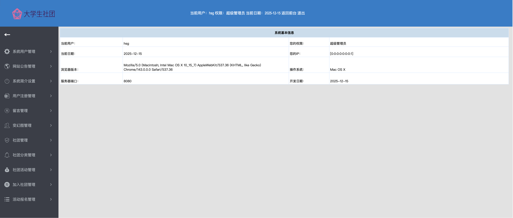
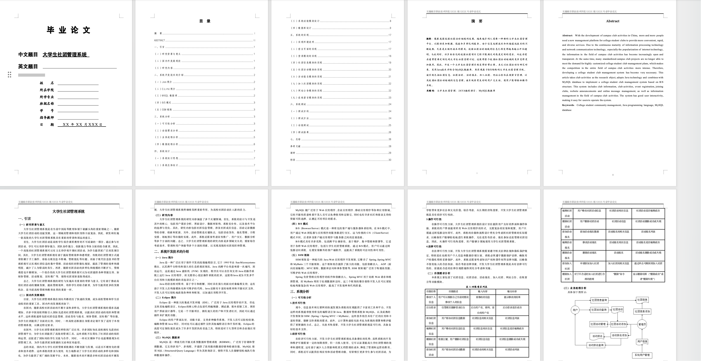

# 大学生社团管理系统

基于SSM框架（Spring + SpringMVC + MyBatis）开发的大学生社团管理系统。

## 📋 目录

- [系统简介](#系统简介)
- [技术栈](#技术栈)
- [环境要求](#环境要求)
- [快速开始](#快速开始)
- [详细安装步骤](#详细安装步骤)
- [使用说明](#使用说明)
- [项目结构](#项目结构)
- [常见问题](#常见问题)


主页： http://localhost:8080/ssmd/userlog.jsp 
账号：006
密码：001
后台管理登录页：http://localhost:8080/ssmd/login.jsp
账号：hsg
密码：hsg


## 系统简介

本系统是一个完整的大学生社团管理平台，提供以下功能：

- 👥 **用户管理**：管理员和注册用户两种角色
- 🏢 **社团管理**：社团信息、分类管理
- 🎯 **活动管理**：社团活动发布、报名
- 📝 **信息发布**：新闻通知、公告
- 💬 **互动功能**：留言板、评论
- 📊 **数据统计**：图表展示、数据导出

### 后台界面


### 前台界面


### 论文


## 技术栈

### 后端框架
- **Spring** 5.3.39
- **Spring MVC** 5.3.39
- **MyBatis** 3.5.16
- **MyBatis-Spring** 2.1.2

### 数据库
- **MySQL** 8.0+ / 9.x
- **MySQL Connector/J** 8.0.33

### 前端技术
- **JSP** + **JSTL**
- **JavaScript** + **jQuery**
- **ECharts** (数据可视化)
- **Bootstrap** (部分页面)

### 开发工具
- **JDK** 17 (推荐) / JDK 8+
- **Maven** 3.6+
- **Jetty** 9.4 (开发环境)
- **Tomcat** 8.5+ (生产环境)

## 环境要求

### 必需环境

| 软件 | 版本要求 | 说明 |
|------|---------|------|
| JDK | 8 / 11 / 17 | 推荐使用JDK 17 |
| Maven | 3.6+ | 构建工具 |
| MySQL | 5.7+ / 8.x / 9.x | 数据库 |

### 可选环境

- **Git**: 用于版本控制
- **IDE**: IntelliJ IDEA / Eclipse / VS Code

## 快速开始

查看[快速开始指南](QUICK_START.md)

## 详细安装步骤

### 步骤1：安装JDK

#### macOS
```bash
# 使用Homebrew安装
brew install openjdk@17

# 配置环境变量
echo 'export JAVA_HOME=$(/usr/libexec/java_home -v 17)' >> ~/.zshrc
source ~/.zshrc

# 验证安装
java -version
```

#### Windows
1. 下载JDK 17：https://adoptium.net/
2. 安装并配置环境变量 `JAVA_HOME`
3. 验证：`java -version`

#### Linux
```bash
# Ubuntu/Debian
sudo apt update
sudo apt install openjdk-17-jdk

# CentOS/RHEL
sudo yum install java-17-openjdk-devel

# 验证
java -version
```

### 步骤2：安装Maven

#### macOS
```bash
brew install maven
mvn -version
```

#### Windows
1. 下载Maven：https://maven.apache.org/download.cgi
2. 解压到 `C:\Program Files\Apache\maven`
3. 配置环境变量 `MAVEN_HOME`
4. 添加 `%MAVEN_HOME%\bin` 到 `PATH`

#### Linux
```bash
# Ubuntu/Debian
sudo apt install maven

# CentOS/RHEL
sudo yum install maven

# 验证
mvn -version
```

### 步骤3：安装MySQL

#### macOS
```bash
# 使用Homebrew安装
brew install mysql

# 启动MySQL服务
brew services start mysql

# 设置root密码
mysql_secure_installation
```

#### Windows
1. 下载MySQL：https://dev.mysql.com/downloads/mysql/
2. 运行安装程序
3. 记住设置的root密码

#### Linux
```bash
# Ubuntu/Debian
sudo apt install mysql-server
sudo systemctl start mysql
sudo mysql_secure_installation

# CentOS/RHEL
sudo yum install mysql-server
sudo systemctl start mysqld
sudo mysql_secure_installation
```

### 步骤4：导入数据库

```bash
# 方式1：使用命令行
mysql -u root -p123456 < database/ssmdxsstglxthsg4341awcg.sql

# 方式2：使用初始化脚本
chmod +x init-database.sh
./init-database.sh
```

### 步骤5：编译项目

```bash
# 清理并编译
mvn clean compile

# 如果编译成功，会看到：
# [INFO] BUILD SUCCESS
```

### 步骤6：运行项目

```bash
# 开发模式（推荐）
./run.sh

# 或者
mvn jetty:run
```

服务器启动后，访问：**http://localhost:8080/ssmd**

## 使用说明

### 管理员功能

登录后可以：

1. **用户管理**
   - 查看所有注册用户
   - 审核用户注册申请
   - 管理用户权限

2. **社团管理**
   - 添加/编辑/删除社团
   - 管理社团分类
   - 审核社团申请

3. **活动管理**
   - 发布社团活动
   - 查看活动报名情况
   - 导出报名数据

4. **内容管理**
   - 发布新闻通知
   - 管理留言板
   - 回复用户评论

5. **数据统计**
   - 查看系统统计图表
   - 导出Excel报表

### 普通用户功能

1. **注册登录**
   - 用户注册（需管理员审核）
   - 登录系统

2. **浏览信息**
   - 查看社团列表
   - 浏览活动信息
   - 阅读新闻公告

3. **参与活动**
   - 申请加入社团
   - 报名参加活动
   - 收藏感兴趣的社团

4. **互动交流**
   - 发表留言
   - 评论活动

## 项目结构

```
web-based-club-management-system/
├── src/                          # Java源代码
│   ├── com/
│   │   ├── controller/          # 控制器层
│   │   ├── service/             # 服务层
│   │   ├── dao/                 # 数据访问层
│   │   ├── entity/              # 实体类
│   │   ├── mapper/              # MyBatis映射文件
│   │   └── util/                # 工具类
│   ├── applicationContext.xml   # Spring配置
│   ├── springMVC-config.xml     # SpringMVC配置
│   └── mybatis-config.xml       # MyBatis配置
├── WebRoot/                      # Web资源目录
│   ├── WEB-INF/
│   │   ├── web.xml              # Web应用配置
│   │   └── lib/                 # 依赖JAR包
│   ├── *.jsp                    # JSP页面
│   ├── js/                      # JavaScript文件
│   ├── images/                  # 图片资源
│   └── upload/                  # 上传文件目录
├── config/                       # 配置文件
│   └── configuration.properties # 数据库配置
├── database/                     # 数据库脚本
│   └── ssmdxsstglxthsg4341awcg.sql
├── pom.xml                       # Maven配置
├── run.sh                        # 启动脚本
├── init-database.sh             # 数据库初始化脚本
└── README.md                     # 本文件
```

## 常见问题

### 1. 编译错误：找不到符号

**问题**：Maven编译时报错 `找不到符号`

**解决**：
```bash
# 清理并重新编译
mvn clean compile
```

### 2. 数据库连接失败

**问题**：启动时报错 `Access denied for user 'root'@'localhost'`

**解决**：
1. 检查MySQL是否启动：`mysql -u root -p`
2. 确认密码正确
3. 修改配置文件中的密码（见"修改数据库配置"）

### 3. 端口8080被占用

**问题**：启动时报错 `Address already in use`

**解决**：
```bash
# 查找占用端口的进程
lsof -i :8080

# 杀死进程
kill -9 <PID>

# 或修改pom.xml中的端口配置
```

### 4. JSP页面乱码

**问题**：页面显示中文乱码

**解决**：
- 本项目已修复所有编码问题
- 确保使用 `./run.sh` 启动（已配置UTF-8）

### 5. Maven下载依赖慢

**问题**：Maven下载依赖很慢

**解决**：配置国内镜像（阿里云）

编辑 `~/.m2/settings.xml`：
```xml
<mirrors>
  <mirror>
    <id>aliyun</id>
    <mirrorOf>central</mirrorOf>
    <url>https://maven.aliyun.com/repository/public</url>
  </mirror>
</mirrors>
```


## 技术支持

### 版本信息

- **当前版本**：1.0.0
- **最后更新**：2025-11-25
- **Spring版本**：5.3.39
- **MyBatis版本**：3.5.16


### 开发文档

- [Spring 5.3 文档](https://docs.spring.io/spring-framework/docs/5.3.x/reference/html/)
- [MyBatis 3 文档](https://mybatis.org/mybatis-3/zh/index.html)
- [MySQL 8.0 文档](https://dev.mysql.com/doc/refman/8.0/en/)

## 许可证

本项目仅供学习交流使用。

---

**祝您使用愉快！** 🎉

如有问题，请检查"常见问题"部分或查看项目文档。
